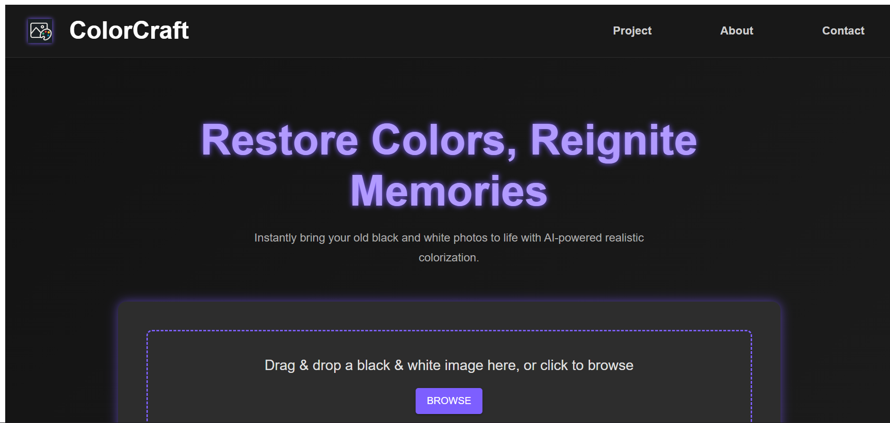
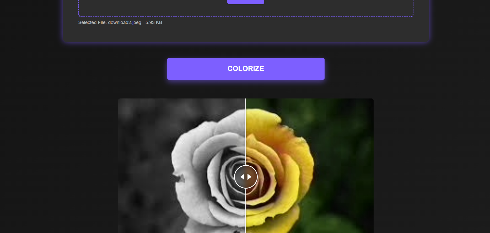

# ColorCraft

A full-stack image colorization system: Seamlessly upload, process, and manage images with modular, scalable technologies.

---

## Table of Contents
- [Features](#features)
- [Tech Stack](#tech-stack)
- [Architecture](#architecture)
- [Getting Started](#getting-started)
- [Project Structure](#project-structure)
- [API Overview](#api-overview)
- [Contributing](#contributing)
- [License](#license)

---
## ScreenShots




---
## Features
- **Drag-and-drop or file upload** for original images
- **AI-powered image colorization** using deep learning models
- **View original & colorized images** seamlessly
- **Metadata management** for all uploads (filename, timestamps)
- **Scalable, modular architecture**—backend, database, and colorization run independently

---

## Tech Stack
- **Frontend:** React
    - Component-based UI, asynchronous API interactions
- **Backend API:** Java Spring Boot
    - Handles file uploads, REST API, security, metadata persistence
- **Database:** MySQL
    - Stores metadata: filename, timestamps, etc.
- **Image Processor:** Python Flask + OpenCV
    - Exposes REST API, runs AI model for colorization

---

## Architecture


**Work flow:**
1. User uploads image on frontend
2. Spring Boot receives, saves metadata, forwards image to Flask service
3. Flask processes, returns colorized image
4. Spring Boot sends colorized image back to frontend
5. All upload/processing steps recorded in metadata

---

## Getting Started

### 1. Clone the Repository
git clone https://github.com/AbhiramNU/ColorCraft.git

### 2. Install Dependencies
- **Frontend:**
    ```
    cd reactapp
    npm install
    ```
- **Backend (Spring Boot):**
    - Ensure Java 11+
- **Python (Flask Service):**
    ```
    cd python-colorizer
    pip install -r requirements.txt
    ```

### 3. Configure MySQL Connection
Edit `src/main/resources/application.properties`:
```
spring.datasource.url=jdbc:mysql://localhost:3306/colorizer_db
spring.datasource.username=your_username
spring.datasource.password=your_password
spring.jpa.hibernate.ddl-auto=update
spring.jpa.show-sql=true
```

### 4. Environment Setup
- Start MySQL server
- Run Flask colorizer
    ```
    python app.py
    ```
- Run Spring Boot backend
    ```
    mvn spring-boot:run
    ```
- Run React frontend
    ```
    npm start
    ```

---

## Project Structure


---

## API Overview

| Endpoint   | Method | Description                   | Request            | Response     |
|------------|--------|------------------------------|--------------------|--------------|
| `/api/colorize` | POST   | Upload image, get colorized result | multipart file upload | image/jpeg    |

---

## Contributing

We welcome feedback, bug reports, and feature requests!
Want to add new models or UI improvements? Fork and submit a PR.

- Fork the repository
- Clone your fork
- Create a feature branch
- Commit changes and push
- Open a pull request

---

## License

MIT License — see [LICENSE](LICENSE) for details.

---

